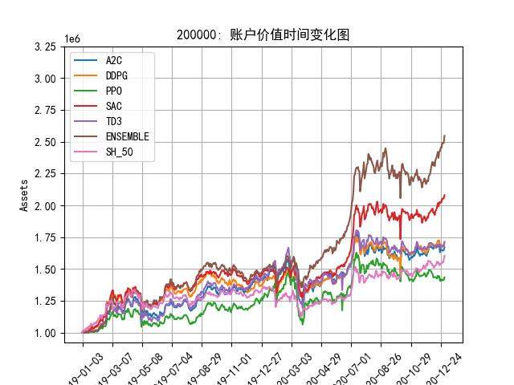

# Reinforcement Learning for portfolio management

The project aims to implement commom Reinforcement Learning on portfolio management task.
Done by Yuan Fang, Advised by Hua Cheng

Agent: A2C, DDPG, PPO, TD3, SAC
Market: SZ50
Train_set: 2008.1.5 - 2018.12
Test Set: 2019.1 - 2020.12

### Quick Start

```
conda create -n=RLportfolio python=3.8
pip install python 

python agent_train.py \
	--model_type="PPO_improve" \
	--max_train_steps=100000 \
	--update-interval=100 \

```


### Result



